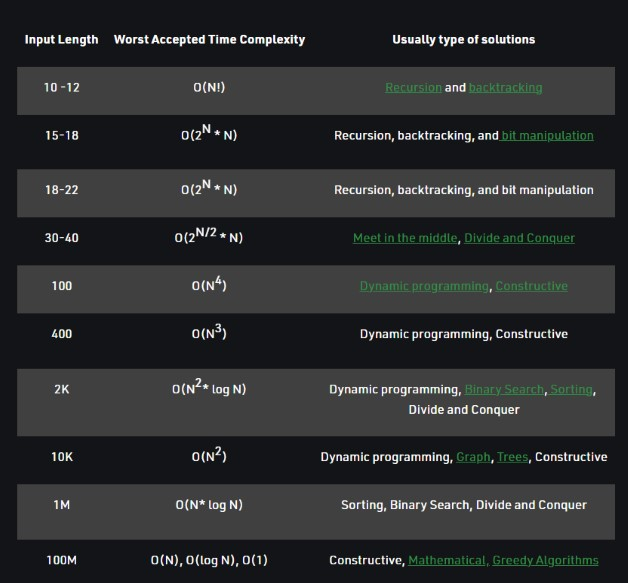

Time complexity refers to the amount of time it takes for an algorithm to run and complete its task, typically measured in terms of the size of the input.

In simple terms, an algorithm's time complexity is how long it takes for the algorithm to complete as the size of the input increases. For example, if an algorithm has a time complexity of O(n), this means that the time it takes to complete the algorithm increases linearly with the size of the input. So if the input size doubles, the time it takes to complete the algorithm will also double.

There are several different ways to express time complexity, with the most common being the "big O" notation. This notation allows us to express the time complexity of an algorithm in a standardized way, without having to consider the specific details of the algorithm or the hardware it is running on.

For example, some common time complexities expressed using big O notation are:

O(1): Constant time complexity. This means that the time it takes for the algorithm to complete is independent of the size of the input.

O(log n): Logarithmic time complexity. This means that the time it takes for the algorithm to complete increases logarithmically with the size of the input.

O(n): Linear time complexity. This means that the time it takes for the algorithm to complete increases linearly with the size of the input.

O(n^2): Quadratic time complexity. This means that the time it takes for the algorithm to complete increases by the square of the size of the input.

